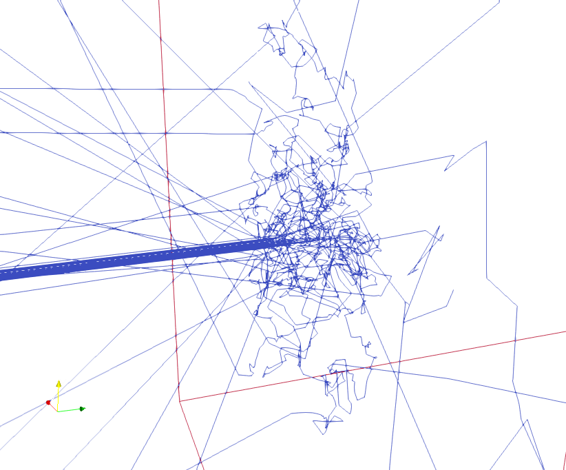
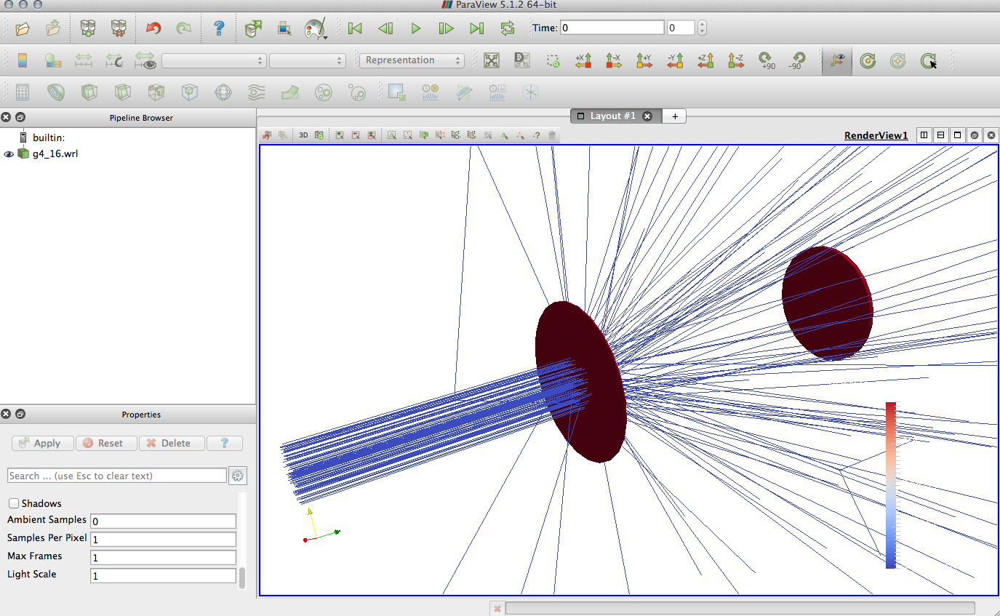

.. Grasshopper documentation master file, created by
   sphinx-quickstart on Tue Dec 10 11:46:47 2019.
   You can adapt this file completely to your liking, but it should at least
   contain the root `toctree` directive.

Grasshopper: A Geant4 Simulation Program!
=========================================

Motivation
----------
Current particle physics simulations take place largely within small communities developing limited tools for specific areas of study. 
These particle simulations are essential to evaluating environments outside of the realm of experimentation in the radiation sciences. 
While multi-use toolkits exist for particles simulation (such as MCNP or SRIM), these computational tools are often difficult for untrained users to adapt into their projects. 
Geant4 is one such toolkit used widely by physicists in radiology, fission reactor work, and space irradiation studies among many other fields [1]. 
Geant4 can be adapted for use in other programs using the methods supplied by the open source code provided. 
In addition, Geant4 relies on various databases shared by institutes such as NIST. 
Unfortunately, Geant4 and the related libraries are not a common program to install and use for scientific simulation users or the general public interested in this work [2]. 
However, a widely applicable simulation engine using Geant4, called Grasshopper, has been developed to allow for generating straightforward Monte Carlo simulations for engineers 
and scientists in a wide range of fields.

Current Work
------------
Grasshopper is currently being benchmarked against other particle simulation tools. By comparing results of major
databases of particle physics constants, we can evaluate the real world simularity of the simulation.

Screenshots from Grasshopper
----------------------------
A view of your workspace:

.. image:: _images/GRSHPRdoc3.png
   :width: 600

A visualization of a 1 MeV neutron beam entering a water volume, undergoing thermalization.

For this particular simulation, you can see the energy distribution of the electrons hitting the detector in the plot
below (from ROOT):

.. image:: _images/GRSHPRdoc1.png
   :width: 600

Here is the view of a '.wrl' file in Paraview:

.. important:: Recommended publication for citing
   A. Danagoulian, J. Miske "`Grasshopper: A Geant4 code for
   Research and Development of Radiation Transport`"

Indices and tables
==================

* :ref:`genindex`
* :ref:`modindex`
* :ref:`search`

.. only:: html

   --------
   Contents
   --------

.. toctree::
   getting_started/index
   examples/index
   releasenotes/index
   methods/index
   usersguide/index
   devguide/index
   pythonapi/index
   io_formats/index
   publications
   license